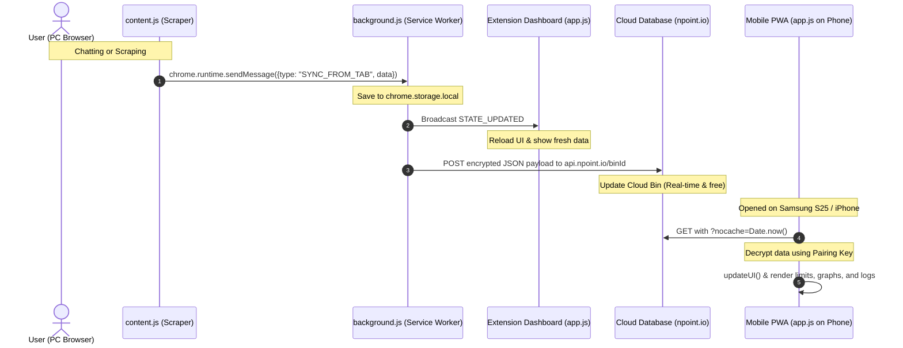

# Ultimate Handoff & Project Summary: LLM Usage Dashboard & Cloud Sync

This document is the ultimate, exhaustive, and self-contained handoff guide for the **Usage Dashboard - LLM Scraper & PWA** project. It contains everything required for an AI coding assistant (like **Codex**, **Claude Code**, or **Cursor**) to immediately take over development, understand the exact codebase state, continue debugging the remote sync feature, and implement new capabilities without losing context.

---

## 1. Project Overview & Architecture

The system consists of a **Manifest V3 Chrome Extension** (acting as a background scraper and local PC dashboard) and a **Progressive Web App (PWA)** hosted on Netlify (acting as a read-only mobile sync client for phones like the Samsung S25 Ultra or iPhones).



### The Three Environments:
1. **The Scrapers (`content.js`)**: Injected into `claude.ai/*`, `chatgpt.com/*`, and `gemini.google.com/*` tabs. Tracks typed prompts in real-time and scrapes usage limits pages.
2. **PC Extension Dashboard (`app.js` inside Extension)**: Opened via the Chrome Extension icon (`chrome-extension://<id>/index.html`). Reads/writes directly to `chrome.storage.local`, renders SVG circular progress rings, shows analytics charts, manages mobile pairing links, and lists setting logs.
3. **Mobile PWA (`app.js` on Netlify)**: The exact same HTML/JS/CSS files, but served from `https://magnificent-pudding-e68600.netlify.app`. When opened with query parameters `?key=...&bin=...`, it detects mobile pairing config, switches to **read-only sync mode**, hides PC settings, and pulls encrypted usage data from the cloud.

---

## 2. Remote Control Sync (Afstandsbediening Synchronisatie)

Direct scraping from a mobile browser is technically impossible due to **CORS browser restrictions**, **Cloudflare bot protection** on AI sites, and cookie boundaries. Therefore, the phone relies on the PC to scrape. 

To allow the phone to trigger a scrape when the user is away from their desk (but Chrome is open on the PC), a **Remote Control Sync** is implemented via two parallel mechanisms:

* **The Phone Trigger (`requestRemoteRefresh()`)**: When the user clicks "Refresh" on the phone, the PWA first loads the latest cloud data (to capture a baseline `syncStatus.lastSynced` timestamp), then adds `refreshRequested: true` and `refreshRequestedAt: Date.now()`, re-encrypts, and `POST`s it back to `npoint.io`. A verification step 800ms later reads the bin back to confirm the flag landed — shows a yellow toast if not confirmed.
* **The Phone Fast Poll (`startFastPollingForRemoteSync(baseline)`)**: The phone enters a fast poll loop (every 2.5s, up to 36 attempts = 90s window). Completion requires **both** `flagCleared` (refreshRequested is false/absent) **and** `freshScrape` (cloudLastSynced > baselineLastSynced). This prevents false-positive completion on stale npoint.io CDN cache.
* **The PC Background Alarm Poller (`checkForRemoteRefreshRequestBG()` in `background.js`)**: The primary polling mechanism. Runs via `chrome.alarms` every 30 seconds, works even when the dashboard tab is **completely closed**. Throttles to max one trigger per 45s. When `refreshRequested === true` and request is < 2 minutes old, calls `triggerScrapeFromBackground(provider)`.
* **The PC Tab Poller (`checkForRemoteRefreshRequest()` in `app.js`)**: Secondary/fast-path. Runs every 15s when the dashboard tab is open. Complements the background alarm for lower latency when the tab is visible.
* **Background Scrape (`triggerScrapeFromBackground()`)**: Reloads existing AI tabs with `active: false` (no focus stealing). If no tab exists, opens a temporary background tab (`active: false`), waits 8.5s for scraping to complete, then closes it.
* **Reset & Update**: Once the PC scrapers finish, `background.js` pushes fresh data to npoint.io with `refreshRequested: false`. The phone detects the new `lastSynced` timestamp during fast-polling, stops polling, and updates the UI with live data.

---

## 3. File-by-File Deep Dive

Here is the exact mapping of all workspace files:

### 1. `manifest.json`
* **Type**: Chrome Extension manifest (Manifest V3).
* **Version**: `0.5.7`
* **Permissions**: `["storage", "tabs", "alarms"]` — `alarms` is required for `chrome.alarms`-based background polling of the remote refresh flag.
* **Host Permissions**: Allows network requests and content script injections on `*://*.claude.ai/*`, `*://*.chatgpt.com/*`, `*://gemini.google.com/*`, `https://api.npoint.io/*`, and `https://www.npoint.io/*`. Bypasses CORS.
* **Action**: Sets default extension action behavior. Clicking the extension icon opens the local dashboard:
  ```javascript
  chrome.action.onClicked.addListener(() => {
      chrome.tabs.create({ url: chrome.runtime.getURL("index.html") });
  });
  ```

### 2. `background.js`
* **Type**: Extension Background Service Worker.
* **Responsibilities**:
  * Listens for messages from `content.js` content scripts: `SYNC_FROM_TAB` (usage limit pages) and `AUTO_LOG_MESSAGE` (typed chat prompts).
  * Stores user logs, threads, limits, and settings in `chrome.storage.local`.
  * **Log Alignment (`alignRollingLogs`)**: Computes discrepancy between raw scraped tokens/messages and local logs in the current rolling window. Auto-generates proxy correction logs ("Gesynchroniseerde status correctie") to realign UI rings.
  * **Real-time Cloud Push (`pushUserDataToCloud`)**: Symmetric E2E encryption using `CryptoSync` (XOR cipher with base64). Uploads payload to `https://api.npoint.io/${binId}` via HTTP `POST` immediately when data is logged or synced. Always resets `refreshRequested: false` in the uploaded payload so the phone fast-poll can detect fresh scrape completion.
  * **Background Remote Polling (`checkForRemoteRefreshRequestBG`)**: Runs every 30s via `chrome.alarms`. Checks `npoint.io` for `refreshRequested === true`, throttles to one trigger per 45s, calls `triggerScrapeFromBackground()`. Works even when the dashboard tab is fully closed.
  * **Background Scrape (`triggerScrapeFromBackground`)**: Reloads or creates AI tabs with `active: false` so the user's screen never switches away. 8.5s wait for content.js to scrape and report back.
  * **Settings Debug Log (`logSync`)**: Appends status strings to a rotating array `lt_sync_logs` in `chrome.storage.local` for diagnostic display on the Settings tab.

### 3. `content.js`
* **Type**: Injected Content Script.
* **Responsibilities**:
  * **Chat Listeners**: Keydown (Enter) and Send button event handlers on `chatgpt.com`, `claude.ai`, and `gemini.google.com`. Binds every 2000ms. Heuristically estimates tokens (1 token per 4 characters) and packages prompt sizes (short, medium, long, huge).
  * **Claude Scraper**: Parses DOM of `claude.ai/settings/usage` for "Current Session" and "All Models/Weekly limits" cards. Matches percentages and reset countdowns using Regex.
  * **ChatGPT Scraper**: Parses DOM of `chatgpt.com/.../analytics`. Auto-clicks the "Persoonlijk gebruik" (Personal usage) tab on load, parses combined 5h and weekly limit percentage/reset cards.
  * **Gemini Limit Detector**: Monitors Gemini's streaming chat DOM for specific limit/quota phrases (e.g. "try again later", "limiet bereikt") and flags the dashboard as "limit reached" in real-time.

### 4. `app.js`
* **Type**: Main UI Controller & Dual Storage Client.
* **Key Components**:
  * **Dual Storage Wrapper (`DB`)**:
    ```javascript
    const DB = {
        isExtension: typeof chrome !== "undefined" && chrome.storage && chrome.storage.local,
        get(keys, callback) { ... },
        set(data, callback) { ... }
    }
    ```
    If `isExtension` is true (PC), reads/writes to `chrome.storage.local`. If false (Phone PWA), uses `localStorage` with `CookieStorage` back-up fallbacks.
  * **Circle Progress Rings & Pace Evaluation (`updateParallelPace`)**:
    SVGs for remaining token/message capacity. Computes whether the user is consuming limits faster than time is decaying in the rolling window (`capPct < timePct`), dynamically coloring bars and printing "On Track", "Tempo Hoog", or "Gevaar".
  * **Pairing QR Code Generator (`renderMobileSyncSettings`)**:
    Draws a 130x130 QR code targeting `https://magnificent-pudding-e68600.netlify.app/index.html?key=KEY&bin=BIN_ID` using `api.qrserver.com`.
  * **Remote Scrape Hook (`triggerSyncNow`)**:
    Queries open Claude/ChatGPT tabs matching subdomains `*://*.claude.ai/*` and `*://*.chatgpt.com/*`.
    * If found: reloads the tab with `active: false` (no focus stealing) to trigger `content.js` scraping.
    * If not found: creates a temporary tab with `active: false`, waits 8.5 seconds for it to load and scrape, then closes it automatically.
    * *Note on active: false:* Earlier versions used `active: true` which caused the PC screen to switch to the AI tab mid-conversation. Fixed in v0.5.0. Chrome does not throttle tabs that are being reloaded via the extension, so `active: false` works reliably.
  * **Service Worker Registration** (PWA only):
    Calls `reg.update()` at startup and every 5 minutes to force the browser to check for a new SW without waiting for Chrome's internal 24h timer. On `updatefound`, sends `SKIP_WAITING` immediately. On `controllerchange`, reloads the page so the new SW takes effect.
  * **Mobile Read-Only Setup (`applyMobileSyncUI`)**:
    If `isSyncClient()` is true, replaces user headers, hides edit forms, hides pairing QR setups, and maps refresh buttons to `requestRemoteRefresh()`. Box index 0 (Cloud Sync Status) gets a custom layout including the **Ververs handmatig** button and the `#build-info-slot` div. Box indices 1+ are hidden. `#build-info-slot` is rendered here so the build info strip is visible on the phone in Settings.
  * **Build Info Strip (`renderBuildInfoStrip`)**:
    Writes `v0.5.7 · EXT/PWA · SW:v12 · bin:…XXXXXX` into `#build-info-slot` in the Settings tab. Called at startup and when the Settings tab is opened. Queries the active SW for its cache name via `postMessage({ type: "GET_SW_VERSION" })`. Allows visual verification that PC and phone use the same bin and same SW version.

### 5. `index.html` & `style.css`
* **Type**: Frontend View layer.
* **Aesthetics**: Sleek Outfit/Inter typography, animated glowing background blobs, dark glassmorphism panels, customized neon color palettes (Claude orange, ChatGPT emerald, Gemini purple-blue, time bars bronze). Contains the debug Settings log text area (`#sync-debug-logs`).

### 6. `sw.js` & `manifest.webmanifest`
* **Type**: Mobile PWA Assets Cache.
* **Current version**: `CACHE_NAME = 'usagedashboard-cache-v12'`, `APP_BUILD = '0.5.7'`
* **ASSETS list**: includes versioned paths (`app.js?v=0.5.7`, `style.css?v=0.5.7`) for cache-busting — the SW will fetch new files when the query string changes.
* **Fetch strategy**: Stale-while-revalidate. Returns cached response immediately, updates cache from network in background. Strictly ignores non-origin requests so `npoint.io` GETs are never cached locally.
* **Message handlers**: Responds to `GET_SW_VERSION` (returns `cacheName` + `build` to the page via MessageChannel), and `SKIP_WAITING` (activates new SW immediately without waiting for old tabs to close).

---

## 4. End-to-End Encryption & Cloud Database Sync Flow

* **Symmetric Encryption**: Encryption/decryption XOR ciphers in `CryptoSync` must remain mathematically identical in both `app.js` and `background.js`:
  ```javascript
  encrypt(text, key) {
      const textToBytes = new TextEncoder().encode(text);
      const keyBytes = new TextEncoder().encode(key);
      let binaryStr = "";
      for (let i = 0; i < textToBytes.length; i++) {
          const encryptedByte = textToBytes[i] ^ keyBytes[i % keyBytes.length];
          binaryStr += String.fromCharCode(encryptedByte);
      }
      return btoa(binaryStr);
  }
  ```
  Decrypt does the inverse. Since data is encrypted before sending, raw LLM token limits and chat logs are 100% private.
* **CORS & Cache Bypassing**:
  * Pushes are made via `POST` to `https://api.npoint.io/${binId}` which updates the JSON bin and returns 200 OK.
  * Pulls are made via `GET` to `https://api.npoint.io/${binId}?nocache=${Date.now()}` with strict headers:
    `"Cache-Control": "no-cache, no-store, must-revalidate", "Pragma": "no-cache", "Expires": "0"`.
    This generates a Cloudflare `MISS` and completely bypasses CDN edge caching, ensuring the phone PWA instantly pulls fresh scrape data.
* **Netlify Build Credits**: Netlify only hosts the frontend layout code, which is cached statically. All database updates run on `npoint.io` and consume **zero** Netlify build credits!

---

## 5. Huidige staat & handoff-notities

Het systeem werkt volledig en is stabiel per v0.5.7. Onderstaande notities zijn bedoeld als context voor een volgende AI-sessie die het project overneemt.

### Hoe remote refresh nu werkt (volledig geïmplementeerd)
1. Telefoon POST → npoint.io met `refreshRequested: true`
2. `background.js` alarm (elke 30s) detecteert de vlag — werkt ook zonder open dashboardtab
3. Scrapers draaien op de achtergrond (`active: false`, geen schermwissel)
4. Background.js pushed verse data + `refreshRequested: false` naar npoint.io
5. Telefoon fast-poll (2.5s interval, max 90s) detecteert nieuwere `lastSynced` timestamp → UI update

### Diagnostiek via het logboek
Als remote sync stokt, open **Settings** op de PC-extensie en kijk in **Synchronisatie Logboek (Debug)**:
* Succesvolle trigger: `[Cloud Remote BG] Telefoon vroeg om refresh — scrapers worden op achtergrond gestart`
* Scrape voltooid: `[BG Scrape] claude tab geladen, wacht op scrape...` → `[BG] Staat van extensie cloud gepusht`
* Geen trigger zichtbaar? Check of de extensie is herladen na de laatste update (`chrome://extensions` → Reload)

### Telefoon toont oude data?
1. Sluit de PWA volledig af en open opnieuw → SW update wordt afgedwongen via `reg.update()`
2. Ga naar **Settings** op de telefoon → controleer `v0.5.7 · PWA · SW:v12 · bin:…XXXXXX`
3. Als SW-versie lager is: wacht ~30s, de `controllerchange` event herlaadt automatisch

### Netlify deploy (GitHub → auto-deploy)
* Repo: **https://github.com/DCS-Rob/usage-dashboard** (publiek)
* Netlify site: `magnificent-pudding-e68600.netlify.app`
* Deploy trigger: elke `git push` naar `main` → automatische Netlify build (~15 credits)
* Alleen PWA-bestanden via Netlify: `app.js`, `index.html`, `style.css`, `sw.js`, `manifest.webmanifest`, `assets/*`
* Extensie-bestanden (`background.js`, `content.js`, `manifest.json`) gaan **niet** via Netlify — reload via `chrome://extensions`

---

## 5a. Deployment & kosten (Netlify)

De mobiele PWA wordt gehost op **https://magnificent-pudding-e68600.netlify.app**. De Chrome-extensie draait lokaal in elke browser zonder deploy.

### Hoe wijzigingen live komen op de PWA

Wijzigingen in `app.js`, `index.html`, `style.css`, `sw.js`, `manifest.webmanifest` of `assets/*` moeten opnieuw geüpload worden naar Netlify. Wijzigingen in `background.js`, `content.js`, of `manifest.json` (Chrome-extensie deel) gaan **niet** via Netlify — die hoeven alleen lokaal opnieuw geladen via `chrome://extensions` → Reload.

### Deploy-kosten

Iedere production deploy op Netlify kost ~**15 credits** ongeacht of het via drag-and-drop, Netlify CLI of Git-koppeling gaat. Het type deploy-trigger verandert de kosten *niet*. Strategie: bundel meerdere wijzigingen tot één deploy in plaats van na elke kleine fix opnieuw te uploaden.

### Deploy-methoden (geen kostenverschil, wel workflow-verschil)

1. **Git-gekoppeld (GitHub)** ✅ **(huidig, aanbevolen)**: `git push` → automatische Netlify deploy. Versiegeschiedenis + rollback ingebouwd. Repo is publiek zodat Netlify de contributor-check bypast.
2. **Netlify CLI**: één commando `netlify deploy --prod --dir=.`. Vereist `netlify login` (browser-flow). Handig als fallback als GitHub-integratie hapert.
3. **Drag-and-drop**: Netlify dashboard → site → Deploys-tab → folder selecteren. Foutgevoelig (bestand vergeten = stuk). Alleen als noodoplossing.

> **Let op**: deploys van commits door een niet-geverifieerde GitHub contributor falen op private Netlify-repos. De repo is daarom op **public** gezet (2026-05-23). Broncode is openbaar zichtbaar; alle gevoelige data (pairing keys, cloud data) loopt via npoint.io en is E2E versleuteld.

### Delen met anderen — twee verschillende scenario's

| Scenario | Oplossing | Vereist GitHub? |
|----------|-----------|-----------------|
| Iemand moet alleen het dashboard *zien* op zijn telefoon | Open PC-extensie → Settings → Mobiele Sync → QR-code scannen op de andere telefoon, of stuur de PWA-link `?key=...&bin=...` door | **Nee** |
| Iemand moet mee kunnen *ontwikkelen* aan de code | Private GitHub-repo + collaborator-invite, of Public repo en clonelink delen | Ja |

> **Belangrijk:** alle gegevens die naar npoint.io gaan zijn end-to-end versleuteld met de pairing key. Een gedeelde PWA-URL geeft alleen toegang aan wie de specifieke key in de URL heeft. Behandel die URL daarom als een wachtwoord — niet publiek delen.

---

## 5b. Versiebeheer-protocol (verplicht bij iedere wijziging)

Elke functionele wijziging in `app.js`, `background.js`, `content.js`, `manifest.json` of `sw.js` moet samengaan met:

1. **`manifest.json` → `"version"` ophogen.** Schema is `MAJOR.MINOR.PATCH`:
   * **PATCH** (+0.0.1): bugfix of kleine UI-tweak zonder gedragsverandering naar buiten.
   * **MINOR** (+0.1.0): nieuwe feature of zichtbare gedragsverandering (nieuwe knop, nieuw poll-mechanisme, schema-uitbreiding).
   * **MAJOR** (+1.0.0): breaking change (bestaande pairings/bestanden niet meer compatibel, of grote architectuurherziening).
2. **`sw.js` → `CACHE_NAME` ophogen** (bv. `usagedashboard-cache-v6` → `v7`) zodat de mobiele PWA gegarandeerd de nieuwe `app.js` ophaalt. Doe dit **altijd** wanneer `app.js`, `index.html`, `style.css` of een asset onder `ASSETS` is gewijzigd.
3. **`Version history`-tabel hieronder bijwerken** in deze `project_summary.md` met datum + één regel changelog.
4. **Extensie reloaden** op de PC via `chrome://extensions` en de PWA op de telefoon helemaal sluiten & opnieuw openen om de nieuwe SW te activeren.

### Version history

| Versie  | Datum       | Wijziging |
|---------|-------------|-----------|
| 0.5.8   | 2026-05-25  | Claude wekelijkse tijdsbalk grijs (0%) gerepareerd: `resetWeekly`-string "Resets in X hr Y min Z" werd niet geparsed voor de balk-percentage. Fix: "Resets in" prefix strippen + tijdcomponenten parsen → `claudeWeeklyTimePct` correct berekend. Cache → v13. |
| 0.5.7   | 2026-05-23  | `#build-info-slot` toegevoegd aan mobiele Settings-view (`applyMobileSyncUI` box[0]), zodat build info ook zichtbaar is op de telefoon (was verborgen omdat de debug-logbox op mobiel `display:none` werd). Cache → v12. |
| 0.5.6   | 2026-05-23  | Build info-strip verplaatst van floating overlay naar inline `#build-info-slot` binnen Settings-tab. PWA forceert actieve SW-update via `reg.update()` bij start + iedere 5 min; `controllerchange` → auto-reload. Cache → v11. |
| 0.5.5   | 2026-05-23  | Opruimen logboek: diagnostische `[DBG]` logs verwijderd. Dubbele cloud-push geëlimineerd (`STATE_UPDATED`-handler doet geen extra `pushUserDataToCloud()` meer). Cache → v10. |
| 0.5.4   | 2026-05-23  | Cache-busting via `?v=` query strings op `app.js`/`style.css`. SW reageert op `SKIP_WAITING` message; `controllerchange` → auto-reload. GitHub-repo aangemaakt (`DCS-Rob/usage-dashboard`), Netlify gekoppeld via Git. Cache → v9. |
| 0.5.3   | 2026-05-23  | Build info-strip introduceert: toont `v · EXT/PWA · SW:vX · bin:…XXXXXX` linksonder. SW beantwoordt `GET_SW_VERSION` postMessage. Cache → v8. |
| 0.5.2   | 2026-05-23  | Diagnostische logSync bij iedere remote-poll (app.js + background.js); versiebeheer-protocol toegevoegd aan project_summary. |
| 0.5.1   | 2026-05-23  | Fast-poll completion vereist nieuwere `lastSynced` timestamp dan baseline — voorkomt false-positive op stale npoint-cache. |
| 0.5.0   | 2026-05-23  | Telefoon-refresh laadt eerst cloud-state (baseline), dan remote-trigger; PC scrape stil op achtergrond (`active:false`); `chrome.alarms`-poller in background.js zodat remote-trigger werkt zonder open dashboardtab. |
| 1.0 → 0.5.0 | 2026-05-23 | Versie teruggezet naar realistische 0.5.x range (project in actieve ontwikkelfase). |

---

## 6. Completed Work Checklist (Done & Verified)

- `[x]` **Subdomain Match Fix**: Corrected `chrome.tabs.query` pattern to `*://*.claude.ai/*` and `*://*.chatgpt.com/*` so subdomains (like `www.`) are matched.
- `[x]` **No Screen Switching During Sync**: Changed `active: true` → `active: false` in `triggerSyncNow` and `triggerScrapeFromBackground`. PC screen no longer switches to AI tabs during background scrapes.
- `[x]` **Cookie Storage Fallback**: Implemented `CookieStorage` fallbacks in `app.js` to preserve pairing keys when iOS Safari aggressively purges local storage.
- `[x]` **PWA Null Pointer Protection**: Added null-checks in `updateScraperStatusLabels` to prevent PWA interface crashes when status elements are hidden.
- `[x]` **Remote Control Sync (volledig)**: Phone refresh triggers background scrape on PC via npoint.io flag. Works when dashboard tab is closed via `chrome.alarms`. Fast-poll uses baseline timestamp to prevent false-positive completion on stale CDN cache.
- `[x]` **No Duplicate Cloud Uploads**: Removed `pushUserDataToCloud()` from `STATE_UPDATED` handler — background.js already pushes before broadcasting.
- `[x]` **Build Info Strip**: Shows `v · EXT/PWA · SW:vX · bin:…XXXXXX` in Settings tab on both PC extension and phone PWA. Queries active SW for cache name via `GET_SW_VERSION` postMessage.
- `[x]` **Forced SW Updates**: `reg.update()` at startup + every 5 min. `SKIP_WAITING` on new SW install. `controllerchange` → auto page reload. Phone no longer stuck on old SW for up to 24h.
- `[x]` **Cache Busting**: `app.js?v=X.X.X` and `style.css?v=X.X.X` query strings in `index.html` and SW ASSETS list ensure fresh files are fetched on version bump.
- `[x]` **GitHub + Netlify Auto-Deploy Pipeline**: `git push` → auto Netlify deploy. Repo is public (`DCS-Rob/usage-dashboard`) to bypass Netlify's verified-contributor restriction on private repos.
- `[x]` **Version Protocol**: Every change bumps `manifest.json` version + `sw.js` CACHE_NAME + version history table in `project_summary.md`.

---

## 7. Roadmap & TODO

Ideeën en verbeteringen voor toekomstige sessies, op volgorde van prioriteit.

---

### 🏠 TODO-1: Lokaal hosten op OpenClaw-infrastructuur (hoge prioriteit)

**Idee:** De PWA verplaatsen van Netlify naar een van de altijd-online OpenClaw-machines, zodat er geen Netlify-credits meer verbruikt worden per deploy en de hosting volledig in eigen beheer is.

**Beschikbare machines (beide altijd online via Tailscale):**

| Machine | Tailscale URL | Aanbevolen voor |
|---|---|---|
| `robot-controller` | `https://robot-controller.tail00aec2.ts.net` | Voorkeur — draait al `main` web interface |
| `agents-controller` | `https://agents-controller.tail00aec2.ts.net` | Alternatief |

**Wat er nodig is:**

1. **Statische fileserver op de machine** — de PWA is puur HTML/CSS/JS, geen backend nodig. Opties:
   - `nginx` (aanbevolen — al aanwezig op de machine als OpenClaw een web interface draait)
   - `python3 -m http.server` als snelle test
   - Een kleine Node.js Express server (past in OpenClaw-ecosysteem)

2. **HTTPS vereist voor PWA/Service Worker** — browsers weigeren Service Workers op onbeveiligde origins. Tailscale biedt gratis HTTPS via `https://<machine>.tail00aec2.ts.net` (Tailscale Serve feature). Alternatief: Let's Encrypt cert via Caddy/nginx.

3. **Deploy workflow aanpassen** — in plaats van `git push` → Netlify, wordt het: `git push` → SSH naar machine → `git pull` + nginx serveert automatisch de nieuwe versie. Of een eenvoudige GitHub Action die via SSH deployt.

4. **Pairing URL updaten** — na de verhuizing krijgt de telefoon een nieuwe PWA-URL (`https://robot-controller.tail00aec2.ts.net/...?key=...&bin=...`). Bestaande koppeling verwijderen en opnieuw koppelen via de extensie.

5. **Telefoon toegang** — de telefoon moet verbinding kunnen maken met de Tailscale URL. Dit vereist dat **Tailscale ook op de telefoon is geïnstalleerd en ingelogd** op hetzelfde Tailscale-netwerk (`tail00aec2.ts.net`). Alternatief: machine publiek bereikbaar maken via een domein + reverse proxy (maar dat is minder veilig).

**Voordeel ten opzichte van Netlify:**
- Geen credits per deploy
- Deploy = simpele `git pull` op de machine (seconden, geen build-queue)
- Volledig in eigen beheer, geen externe afhankelijkheid
- Kan in de toekomst uitgebreid worden met een server-side scraper (zie TODO-2)

---

### 🤖 TODO-2: Server-side scraper op OpenClaw (langetermijn)

**Idee:** De Chrome-extensie is nu het enige scrape-mechanisme — de PC moet aan staan en Chrome open hebben. Een logische volgende stap is een **server-side headless scraper** op `robot-controller` of `agents-controller` die automatisch scrapet zonder afhankelijkheid van de PC-browser.

**Aanpak:**
- Playwright of Puppeteer (headless Chromium) op de machine, ingelogd op claude.ai/chatgpt.com met een bestaande sessie (cookies exporteren vanuit de extensie eenmalig)
- Scraper draait als een systemd-service of OpenClaw-agent, scrapet elke X minuten
- Resultaten gaan rechtstreeks naar npoint.io (of een lokale database als npoint.io wegvalt)
- Telefoon en extensie lezen dan van dezelfde bron

**Aandachtspunten:**
- Claude.ai en ChatGPT.com hebben Cloudflare-bescherming — headless detection kan lastig zijn
- Sessie-cookies verlopen, moeten periodiek ververst worden
- De Chrome-extensie kan naast de server-side scraper blijven bestaan als fallback

---

### 🔌 TODO-3: npoint.io vervangen door eigen opslag (langetermijn)

**Idee:** npoint.io is een gratis derde partij zonder SLA. Als alternatief kan de sync-data opgeslagen worden in een lokale database op de OpenClaw-machine (SQLite, Redis, of simpel JSON-bestand) en geserveerd worden via een kleine REST-API endpoint.

**Voordeel:** Geen afhankelijkheid van externe dienst, geen limieten, betere privacy (data verlaat het eigen netwerk niet).

**Vereiste:** De machine moet altijd bereikbaar zijn voor zowel de extensie (PC) als de telefoon — dit sluit direct aan op TODO-1.
