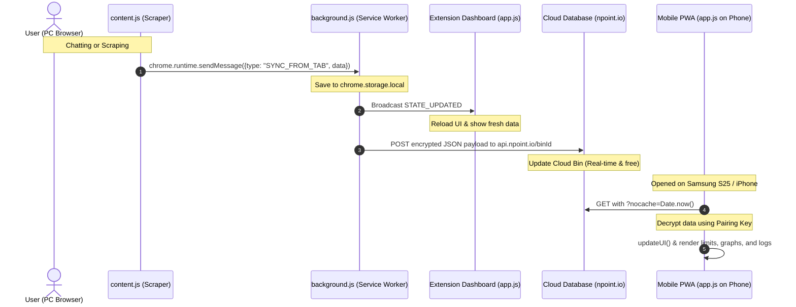

# Ultimate Handoff & Project Summary: LLM Usage Dashboard & Cloud Sync

This document is the ultimate, exhaustive, and self-contained handoff guide for the **Usage Dashboard - LLM Scraper & PWA** project. It contains everything required for an AI coding assistant (like **Codex**, **Claude Code**, or **Cursor**) to immediately take over development, understand the exact codebase state, continue debugging the remote sync feature, and implement new capabilities without losing context.

---

## 1. Project Overview & Architecture

The system consists of a **Manifest V3 Chrome Extension** (acting as a background scraper and local PC dashboard) and a **Progressive Web App (PWA)** hosted on Netlify (acting as a read-only mobile sync client for phones like the Samsung S25 Ultra or iPhones).



### The Three Environments:
1. **The Scrapers (`content.js`)**: Injected into `claude.ai/*`, `chatgpt.com/*`, and `gemini.google.com/*` tabs. Tracks typed prompts in real-time and scrapes usage limits pages.
2. **PC Extension Dashboard (`app.js` inside Extension)**: Opened via the Chrome Extension icon (`chrome-extension://<id>/index.html`). Reads/writes directly to `chrome.storage.local`, renders SVG circular progress rings, shows analytics charts, manages mobile pairing links, and lists setting logs.
3. **Mobile PWA (`app.js` on Netlify)**: The exact same HTML/JS/CSS files, but served from `https://magnificent-pudding-e68600.netlify.app`. When opened with query parameters `?key=...&bin=...`, it detects mobile pairing config, switches to **read-only sync mode**, hides PC settings, and pulls encrypted usage data from the cloud.

---

## 2. Remote Control Sync (Afstandsbediening Synchronisatie)

Direct scraping from a mobile browser is technically impossible due to **CORS browser restrictions**, **Cloudflare bot protection** on AI sites, and cookie boundaries. Therefore, the phone relies on the PC to scrape. 

To allow the phone to trigger a scrape when Rob is away from his desk (but Chrome is open on his PC), a **Remote Control Sync** was recently added:
* **The Phone Trigger (`requestRemoteRefresh()`)**: When the user clicks "Refresh" on the phone, the PWA fetches the latest cloud bin state, adds `refreshRequested: true` and `refreshRequestedAt: Date.now()`, re-encrypts, and `POST`s it back to `npoint.io`.
* **The Phone Fast Poll (`startFastPollingForRemoteSync()`)**: The phone enters a fast poll loop (fetching the bin every 2.5s for 20s) waiting for `refreshRequested` to become `false`.
* **The PC Polling Listener (`checkForRemoteRefreshRequest()`)**: When open, the PC dashboard page polls `npoint.io` every 15s. If it sees `refreshRequested === true` and the request is less than 2 minutes old, it triggers `triggerSyncNow("claude")` and `triggerSyncNow("chatgpt")` automatically on the PC browser.
* **Reset & Update**: Once the PC scrapers finish scraping, the PC uploads the fresh data to npoint.io, resetting `refreshRequested: false`. The phone detects this reset during fast-polling, stops polling, and updates the screen with live data.

---

## 3. File-by-File Deep Dive

Here is the exact mapping of all workspace files:

### 1. `manifest.json`
* **Type**: Chrome Extension manifest (Manifest V3).
* **Permissions**: `["storage", "tabs"]` for storing user profiles and scraping/reloading AI browser tabs.
* **Host Permissions**: Allows network requests and content script injections on `*://*.claude.ai/*`, `*://*.chatgpt.com/*`, `*://gemini.google.com/*`, `https://api.npoint.io/*`, and `https://www.npoint.io/*`. Bypasses CORS.
* **Action**: Sets default extension action behavior. Clicking the extension icon opens the local dashboard:
  ```javascript
  chrome.action.onClicked.addListener(() => {
      chrome.tabs.create({ url: chrome.runtime.getURL("index.html") });
  });
  ```

### 2. `background.js`
* **Type**: Extension Background Service Worker.
* **Responsibilities**:
  * Listens for messages from `content.js` content scripts: `SYNC_FROM_TAB` (usage limit pages) and `AUTO_LOG_MESSAGE` (typed chat prompts).
  * Stores user logs, threads, limits, and settings in `chrome.storage.local`.
  * **Log Alignment (`alignRollingLogs`)**: Computes discrepancy between raw scraped tokens/messages and local logs in the current rolling window. Auto-generates proxy correction logs ("Gesynchroniseerde status correctie") to realign UI rings.
  * **Real-time Cloud Push (`pushUserDataToCloud`)**: Symmetric E2E encryption using `CryptoSync` (XOR cipher with base64). Uploads payload to `https://api.npoint.io/${binId}` via HTTP `POST` immediately when data is logged or synced. Resets `refreshRequested` flags.
  * **Settings Debug Log (`logSync`)**: Appends status strings to a rotating array `lt_sync_logs` in `chrome.storage.local` for diagnostic display on the Settings tab.

### 3. `content.js`
* **Type**: Injected Content Script.
* **Responsibilities**:
  * **Chat Listeners**: Keydown (Enter) and Send button event handlers on `chatgpt.com`, `claude.ai`, and `gemini.google.com`. Binds every 2000ms. Heuristically estimates tokens (1 token per 4 characters) and packages prompt sizes (short, medium, long, huge).
  * **Claude Scraper**: Parses DOM of `claude.ai/settings/usage` for "Current Session" and "All Models/Weekly limits" cards. Matches percentages and reset countdowns using Regex.
  * **ChatGPT Scraper**: Parses DOM of `chatgpt.com/.../analytics`. Auto-clicks the "Persoonlijk gebruik" (Personal usage) tab on load, parses combined 5h and weekly limit percentage/reset cards.
  * **Gemini Limit Detector**: Monitors Gemini's streaming chat DOM for specific limit/quota phrases (e.g. "try again later", "limiet bereikt") and flags the dashboard as "limit reached" in real-time.

### 4. `app.js`
* **Type**: Main UI Controller & Dual Storage Client.
* **Key Components**:
  * **Dual Storage Wrapper (`DB`)**:
    ```javascript
    const DB = {
        isExtension: typeof chrome !== "undefined" && chrome.storage && chrome.storage.local,
        get(keys, callback) { ... },
        set(data, callback) { ... }
    }
    ```
    If `isExtension` is true (PC), reads/writes to `chrome.storage.local`. If false (Phone PWA), uses `localStorage` with `CookieStorage` back-up fallbacks.
  * **Circle Progress Rings & Pace Evaluation (`updateParallelPace`)**:
    SVGs for remaining token/message capacity. Computes whether the user is consuming limits faster than time is decaying in the rolling window (`capPct < timePct`), dynamically coloring bars and printing "On Track", "Tempo Hoog", or "Gevaar".
  * **Pairing QR Code Generator (`renderMobileSyncSettings`)**:
    Draws a 130x130 QR code targeting `https://magnificent-pudding-e68600.netlify.app/index.html?key=KEY&bin=BIN_ID` using `api.qrserver.com`.
  * **Remote Scrape Hook (`triggerSyncNow`)**:
    Queries open Claude/ChatGPT tabs matching subdomains `*://*.claude.ai/*` and `*://*.chatgpt.com/*`.
    * If found: activates the tab (`chrome.tabs.update(id, { active: true })`) and reloads it to trigger `content.js` scraping.
    * If not found: creates a temporary tab in the foreground (`active: true`), waits 6.5 seconds for it to load and scrape, and then closes it automatically.
    * *Why active: true?* Chrome throttles background tabs, freezing React hydration and preventing the scraper from executing. Opening/activating them is the only reliable way.
  * **Mobile Read-Only Setup (`applyMobileSyncUI`)**:
    If `isSyncClient()` is true, replaces user headers, hides edit forms, hides pairing QR setups, and maps refresh buttons to `requestRemoteRefresh()`.

### 5. `index.html` & `style.css`
* **Type**: Frontend View layer.
* **Aesthetics**: Sleek Outfit/Inter typography, animated glowing background blobs, dark glassmorphism panels, customized neon color palettes (Claude orange, ChatGPT emerald, Gemini purple-blue, time bars bronze). Contains the debug Settings log text area (`#sync-debug-logs`).

### 6. `sw.js` & `manifest.webmanifest`
* **Type**: Mobile PWA Assets Cache.
* **Aesthetics**: Static asset list. Stale-while-revalidate fetch strategy, strictly ignoring API requests (`!request.url.startsWith(location.origin)`) so `npoint.io` GETs are never cached locally by the PWA wrapper.

---

## 4. End-to-End Encryption & Cloud Database Sync Flow

* **Symmetric Encryption**: Encryption/decryption XOR ciphers in `CryptoSync` must remain mathematically identical in both `app.js` and `background.js`:
  ```javascript
  encrypt(text, key) {
      const textToBytes = new TextEncoder().encode(text);
      const keyBytes = new TextEncoder().encode(key);
      let binaryStr = "";
      for (let i = 0; i < textToBytes.length; i++) {
          const encryptedByte = textToBytes[i] ^ keyBytes[i % keyBytes.length];
          binaryStr += String.fromCharCode(encryptedByte);
      }
      return btoa(binaryStr);
  }
  ```
  Decrypt does the inverse. Since data is encrypted before sending, raw LLM token limits and chat logs are 100% private.
* **CORS & Cache Bypassing**:
  * Pushes are made via `POST` to `https://api.npoint.io/${binId}` which updates the JSON bin and returns 200 OK.
  * Pulls are made via `GET` to `https://api.npoint.io/${binId}?nocache=${Date.now()}` with strict headers:
    `"Cache-Control": "no-cache, no-store, must-revalidate", "Pragma": "no-cache", "Expires": "0"`.
    This generates a Cloudflare `MISS` and completely bypasses CDN edge caching, ensuring the phone PWA instantly pulls fresh scrape data.
* **Netlify Build Credits**: Netlify only hosts the frontend layout code, which is cached statically. All database updates run on `npoint.io` and consume **zero** Netlify build credits!

---

## 5. Step-by-Step Guide for Continuing in Codex

When taking over this project in Codex, proceed with these exact debugging steps:

### 1. Identify Why the Remote Trigger Fails
The user reports: *"Nee werkt nog altijd niet"* (No, it still doesn't work when refreshing from the phone). 
To diagnose this, run these checks:
1. **Is the PC Extension Reloaded?**
   * Chrome caches extension service workers aggressively. If Rob has not opened `chrome://extensions`, turned on Developer mode, and clicked the circular **Reload** icon on the "Usage Dashboard" card, his PC is still running the old `background.js`/`app.js` without the remote trigger listener!
2. **Is the PC Tab Open and active?**
   * The polling listener `initRemoteRefreshListener()` in `app.js` runs every 15s when `state.currentUser` is loaded. This requires the dashboard tab (`chrome-extension://.../index.html`) to be open in Chrome on the PC. If Chrome has discarded/suspended the dashboard tab, the interval stops running.
   * *Future improvement for Codex:* Move `checkForRemoteRefreshRequest()` into `background.js` using `chrome.alarms` to poll `npoint.io` even if the dashboard tab is completely closed!
3. **Verify the Debug Logbook (`lt_sync_logs`)**:
   * Open the "Settings" tab on the PC dashboard. Check the **Synchronisatie Logboek (Debug)** textbox.
   * If the phone successfully triggered a refresh, you should see:
     `[14:50:22] [Cloud Remote] Afstandsbediening verzoek gedetecteerd vanaf uw telefoon! Scrapers starten...`
   * If you see error traces, CORS blocks, or decryption failures, copy the error to guide your fixes.

---

## 5a. Deployment & kosten (Netlify)

De mobiele PWA wordt gehost op **https://magnificent-pudding-e68600.netlify.app**. De Chrome-extensie draait lokaal in elke browser zonder deploy.

### Hoe wijzigingen live komen op de PWA

Wijzigingen in `app.js`, `index.html`, `style.css`, `sw.js`, `manifest.webmanifest` of `assets/*` moeten opnieuw geüpload worden naar Netlify. Wijzigingen in `background.js`, `content.js`, of `manifest.json` (Chrome-extensie deel) gaan **niet** via Netlify — die hoeven alleen lokaal opnieuw geladen via `chrome://extensions` → Reload.

### Deploy-kosten

Iedere production deploy op Netlify kost ~**15 credits** ongeacht of het via drag-and-drop, Netlify CLI of Git-koppeling gaat. Het type deploy-trigger verandert de kosten *niet*. Strategie: bundel meerdere wijzigingen tot één deploy in plaats van na elke kleine fix opnieuw te uploaden.

### Deploy-methoden (geen kostenverschil, wel workflow-verschil)

1. **Drag-and-drop** (huidig): Netlify dashboard → site → Deploys-tab → folder selecteren. Foutgevoelig (bestand vergeten = stuk).
2. **Netlify CLI**: één commando `netlify deploy --prod --dir=.`. Geen geheugenwerk over welke bestanden, maar Node + login vereist.
3. **Git-gekoppeld (GitHub)**: `git push` → automatische deploy. Geeft bovendien versiegeschiedenis en eenvoudige rollback. Zelfde credits per deploy.

### Delen met anderen — twee verschillende scenario's

| Scenario | Oplossing | Vereist GitHub? |
|----------|-----------|-----------------|
| Iemand moet alleen het dashboard *zien* op zijn telefoon | Open PC-extensie → Settings → Mobiele Sync → QR-code scannen op de andere telefoon, of stuur de PWA-link `?key=...&bin=...` door | **Nee** |
| Iemand moet mee kunnen *ontwikkelen* aan de code | Private GitHub-repo + collaborator-invite, of Public repo en clonelink delen | Ja |

> **Belangrijk:** alle gegevens die naar npoint.io gaan zijn end-to-end versleuteld met de pairing key. Een gedeelde PWA-URL geeft alleen toegang aan wie de specifieke key in de URL heeft. Behandel die URL daarom als een wachtwoord — niet publiek delen.

---

## 5b. Versiebeheer-protocol (verplicht bij iedere wijziging)

Elke functionele wijziging in `app.js`, `background.js`, `content.js`, `manifest.json` of `sw.js` moet samengaan met:

1. **`manifest.json` → `"version"` ophogen.** Schema is `MAJOR.MINOR.PATCH`:
   * **PATCH** (+0.0.1): bugfix of kleine UI-tweak zonder gedragsverandering naar buiten.
   * **MINOR** (+0.1.0): nieuwe feature of zichtbare gedragsverandering (nieuwe knop, nieuw poll-mechanisme, schema-uitbreiding).
   * **MAJOR** (+1.0.0): breaking change (bestaande pairings/bestanden niet meer compatibel, of grote architectuurherziening).
2. **`sw.js` → `CACHE_NAME` ophogen** (bv. `usagedashboard-cache-v6` → `v7`) zodat de mobiele PWA gegarandeerd de nieuwe `app.js` ophaalt. Doe dit **altijd** wanneer `app.js`, `index.html`, `style.css` of een asset onder `ASSETS` is gewijzigd.
3. **`Version history`-tabel hieronder bijwerken** in deze `project_summary.md` met datum + één regel changelog.
4. **Extensie reloaden** op de PC via `chrome://extensions` en de PWA op de telefoon helemaal sluiten & opnieuw openen om de nieuwe SW te activeren.

### Version history

| Versie  | Datum       | Wijziging |
|---------|-------------|-----------|
| 0.5.6   | 2026-05-23  | Build info-strip verplaatst van floating overlay naar inline `#build-info-slot` binnen Settings-tab (alleen zichtbaar als gebruiker bewust naar Settings gaat). PWA forceert nu actief SW-update via `reg.update()` bij start + iedere 5 min, zodat nieuwe service workers niet uren wachten op Chrome's eigen update-timer. Cache → v11. |
| 0.5.5   | 2026-05-23  | Opruimen na geslaagde remote-sync: diagnostische `[Remote Poll DBG]` / `[Remote Poll BG DBG]` logs verwijderd (alleen detection-events worden nog gelogd). Dubbele cloud-push geëlimineerd: `STATE_UPDATED`-handler in app.js doet alleen nog UI-refresh i.p.v. extra `pushUserDataToCloud()` (background.js heeft die push al gedaan vóór de broadcast). Cache → v10. |
| 0.5.4   | 2026-05-23  | Cache-busting via `?v=` query string op `app.js`/`style.css` in index.html zodat browsers gegarandeerd nieuwe code laden. SW gebruikt nu `skipWaiting` op message, en app.js doet `controllerchange`-triggered auto-reload. Build info-strip robuuster (paars/hard zichtbaar, toont altijd iets ook bij fouten). Cache → v9. |
| 0.5.3   | 2026-05-23  | Build info-strip (linksonder) toont app-versie, omgeving (EXT/PWA), SW-cache versie en laatste 6 chars van binId — zodat PC en telefoon visueel verifieerbaar dezelfde bin gebruiken. Service worker beantwoordt nu `GET_SW_VERSION` postMessage. Cache → v8. |
| 0.5.2   | 2026-05-23  | Diagnostische logSync bij iedere remote-poll (zowel app.js als background.js); versiebeheer-protocol toegevoegd aan project_summary. |
| 0.5.1   | 2026-05-23  | Fast-poll completion vereist nu nieuwere `syncStatus.lastSynced` timestamp dan baseline — voorkomt vroegtijdige "klaar"-melding op stale npoint-cache. Versienummer geïntroduceerd. |
| 0.5.0   | 2026-05-23  | Telefoon-refresh trekt direct cloud-state binnen + parallel remote-trigger; PC scrape weer stil op achtergrond (`active:false`); `chrome.alarms`-poller in service worker zodat afstandsbediening ook werkt zonder geopende dashboardtab. |
| 1.0 → 0.5.0 | 2026-05-23 | Versie teruggezet naar realistische 0.5.x range (project nog in actieve debug-fase). |

---

## 6. Completed Work Checklist (Done & Verified)

- `[x]` **Subdomain Match Fix**: Corrected `chrome.tabs.query` pattern to `*://*.claude.ai/*` and `*://*.chatgpt.com/*` so subdomains (like `www.`) are matched.
- `[x]` **Chrome Throttling Bypass**: Configured `active: true` in `chrome.tabs.create` and `chrome.tabs.update` to prevent Chrome from putting scraper tabs to sleep.
- `[x]` **Cookie Storage Fallback**: Implemented `CookieStorage` fallbacks in `app.js` to preserve pairing keys when iOS Safari aggressively purges local storage.
- `[x]` **PWA Null Pointer Protection**: Added solid null-checks in `updateScraperStatusLabels` to prevent PWA interface crashes when status elements are hidden.
- `[x]` **Remote Control Sync Skeleton**: Implemented XOR encrypted triggers (`refreshRequested`) in `app.js` and `background.js` to allow remote PC scrape triggers.
- `[x]` **Service Worker Cache Bumps**: Bumped `sw.js` cache to `v4` to force mobile client updates.
